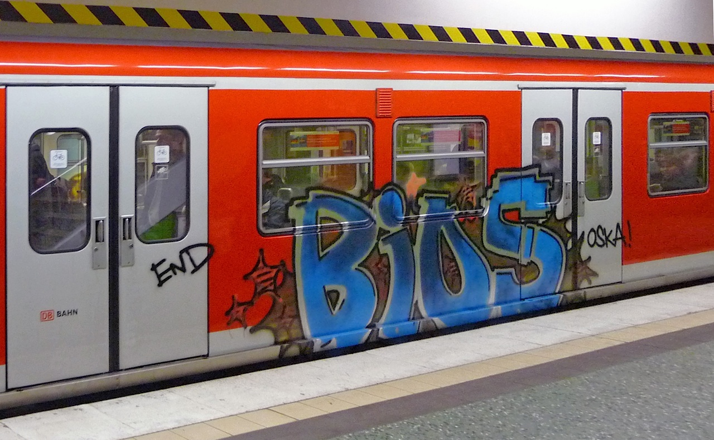

## Writing Proposals

### *Carole Rennie Logan* & *Joe Wright* 
#### __@crgrieve__ & __@joe_jag__

---

## How do you choose which talk you attend at a conference?

### __(discuss in pairs)__

---

# The Talk Title

---

__What's a better title?__

New expense process – Manager update, February 2018

*or*

3 tips you can use for hassle-free expense claims

---

# How to teach bioethics

---

# __1__. Promise benefits

How to teach bioethics

*can become*

How to be an inspiring bioethics teacher

How to teach a bioethics class that makes teenagers think

---

# __2__. Promise a story

How to teach bioethics

*can become*

How a burnt-out teacher reconnected with the love of teaching through bioethics

How a poor school turned delinquent teenagers into philosophers

---

# __3__. Put a number in it

How to teach bioethics

*can become*

Three critical concepts for teaching bioethics

---

# __4__. Provoke curiosity

How to teach bioethics

*can become*

The #1 strategy for teaching bioethics in the classroom

New classroom research reveals the bioethics teaching methodology that gets the best results

---

# __5__. Evoke concern

How to teach bioethics

*can become*

The common mistakes bioethics teachers make

The mistakes I’ve made teaching bioethics and how you can learn from them

---

## __Research__ your target conference

---

# Exercise Time! __Talk Titles__

### (on your own)

---

## Write your talk title with each style

* Promise benefits *(how to win friends)*
* Promise a story *(how a)*
* Put a number in it *(3 ways)*
* Provoke curiosity *(The #1 way)*
* Evoke concern *(The common mistakes)*

---

## Share your  favourite title

### __(discuss with your table)__

---

# The Bio

---

## What makes a bio  stand out?

### __(discuss in pairs)__

---

## Why is a bio important?

---

## Well rounded view of the person

* Current occupation
* Past employers
* Awards and accolades
* Degrees and educational affiliations / recent projects
* Interests and fun facts

---

## Usually 25-200 words

### Written in Third person

---

Nina Freeman is a level designer at Fullbright in Portland, Oregon. She is working on their current game, Tacoma. 

In her personal work, she is most often making vignette games based on her own life stories. She worked as a designer on IGF nominee “how do you Do It?” and IGF Student Honorable Mention “Ladylike.” She designed the recently released “Cibele,” a game about an online relationship created by Star Maid Games. 

You can find her work at ninasays.so, and you can follow her on Twitter at @ninasays.

---

Nina Freeman is a programmer, a poet, and a real life mahou shoujo. She makes and writes about video games.

---

# Exercise Time! __Creating bios__

### (in pairs)

---

## Create a Mind map with these questions

* <X> is currently ...
* Before that <X> was ...
* What lights you up?
* What’s the coolest accomplishment you have?
* What are you a product of?
* What’s important about you that’s not on your CV?

---

## Highlight the parts you'd like to use in your bio

### __(on your own)__

---

# The Abstract

---

## What's the purpose of an abstract?

### __(discuss in pairs)__

---

## What's expected

#### https://www.papercall.io/talks/new

---

# Anatomy of a proposal

* Context / Problem Statement

and

* Teaser / Solution

---

## Context / Problem Statement

* Target Audience
* The problem you are tackling and it's impact
* Motivation (why care?)

---

## Teaser / Solution

* Teaser about how to solve the problem
* Outline of topics covered
* What you'll learn

---

## Get __feedback__

---

# Exercise Time! __Creating your abstract__

### (on your own)

---

## Part 1: Create two columns on an A4 page

* Put headings for __Context__ and __Solution__
* Write keywords for your talk under each one
* Keywords can be ideas. e.g.

  *'Pizza'*
  *'history/future of Pizza'*
  *'priming yeast'*

---

## Part 2: Turn the keywords into sentences

* Aim for between two or three paragraphs
* Write from the perspective of your future audience __(You'll learn...)__
* Tip: Use a question to grab attention

---

## Part 3: Ask for feedback

* Share your abstract with someone else at your table

---

__Give__ and __ask__ us for feedback!

### __@crgrieve__  *Carole Rennie Logan* 

### __@joe_jag__  *Joe Wright* 

---

* Talk Titles by __Olivia Mitchell__:   https://speakingaboutpresenting.com/content/presentation-title/
* Bios by __Catt Small__:   https://cattsmall.com/advice/2016/10/03/become-public-speaker-5.html
* Abstracts by __Lena Reinhard__:   http://wunder.schoenaberselten.com/2016/02/16/how-to-prepare-and-write-a-tech-conference-talk/#proposal-writing